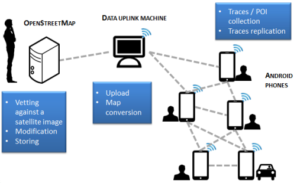
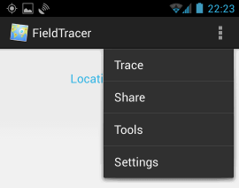
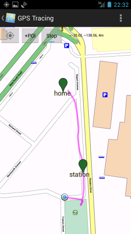
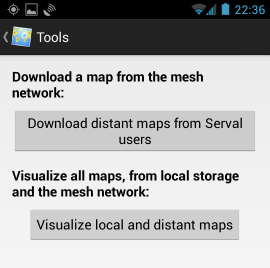
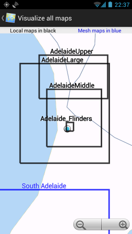
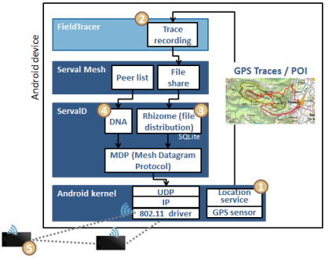
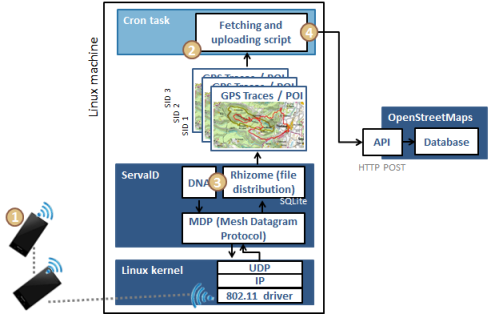

## Introduction ##

**FieldTracer** is an Android application that makes it easy to **acquire GPS traces and Point of Interest after a disaster situation**. Even with no relying infrastructure FieldTracer allows a team to automate the sharing of traces acquisition between them. It also provides offline background map.

Finally those traces can be upload to OpenStreetMap to be reviewed.

## Architecture ##

## Screenshots ##
###Home
At first the application propose you to pre activare the GPS sensor. This can be useful when there is no mobile reception, the sens cannot use the Assisted-GPS and thus take up to 5 minutes to find a signal.

The signal is then acquired and an user can start to trace or to note Point of Interest.

As shown in the menu, the application is divided in 4 activities:

- A **GPS tracing** activity to record in GPX or in plain text
- A **traces sharing** and POI sharing activity that uses Serval Rhizome and from where an user can set automated sharing preferences
- A **tools** activity to show all the maps in the network and locally and to download one map
- A **settings** activity to set which recording format and which background map the application should use

###Trace
In the GPS tracing screen, an user can record a Point of Interest, and start recording a trace using the the Toggle button.
It is also possible to display the last recorded trace from the menu.

When adding a Point of Interest, an user can specify **which type and name** should be used. The POI will then be displayed.

It works the same for the traces.

###Share
Under the share screen it is possible to set **automated sharing** of traces and POI. They will then be automatically be spread in the mesh network using Serval.

### Tools
Under the tools screen it is possible to download a background map from the mesh

Is possible to visualize the background maps from the mesh network and from the local storage. This can be used for instance to know which map should be downloaded.

### Settings
It is possible to specifies the background map used for tracing and which format should be used for traces (GPX or Text)

##The Serval Project and Mapsforge##

###Serval
The application interconnects uses the Serval Mesh for sharing and getting data from a mesh between multiple phones. Serval can actually not only uses a mesh configuration but also a base-station / clients network.

See [http://www.servalproject.org/](http://www.servalproject.org/)

###Mapsforge
The application uses the Mapsforge library to display background maps without having to poll them from Internet.

See [https://code.google.com/p/mapsforge/](https://code.google.com/p/mapsforge/)

##Software stack used
When diffusing the traces within the team:

When uploading the traces to Openstreetmap:

##Installation##

**On Android phones:**

1. Get the Serval Mesh application (Google Play: [https://play.google.com/store/apps/details?id=org.servalproject](https://play.google.com/store/apps/details?id=org.servalproject) )
2. Configure Serval Mesh with a phone number and a name
2. Download the git source code with `git clone https://github.com/LoicLWRT/FieldTracer.git`
3. Open the projet under Eclipse or compile directly with `ant`
2. Get a Mapsforge map of the zone you plan to trace from [http://download.bbbike.org/osm/](http://download.bbbike.org/osm/)
3. Copy the map to the `/sdcard/FieldTracer/` folder
4. You are ready to go :)

**For the OpenStreetMap traces uploader:**

1. Get the serval-dna source code with `git clone https://github.com/servalproject/serval-dna.git`
2. Configure it with
`autoreconf -f -i` then `./configure` and `make`
3. Get the script [https://github.com/LoicLWRT/FieldTracer/blob/master/unix_script/pushing_traces_to_OpenStreetMap.sh](https://github.com/LoicLWRT/FieldTracer/blob/master/unix_script/pushing_traces_to_OpenStreetMap.sh) and place it in the serval-dna folder
4. Configure and run the script to upload traces when one phone is connected to the Unix machine 